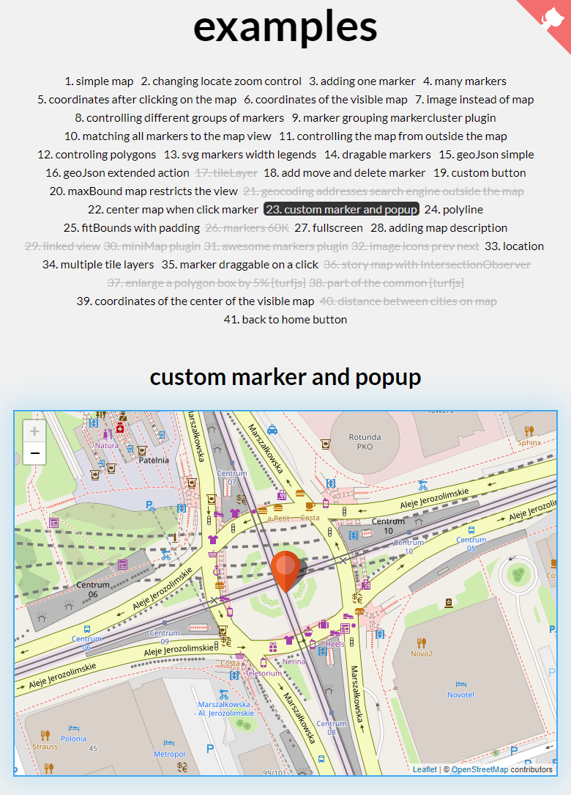

# :maple_leaf: react-leaflet-examples

**react-leaflet-examples** a collection of examples of leaflet map usage

> The full version (vanilla-js) with all working examples can be found at this link [leaflet-examples](https://tomickigrzegorz.github.io/leaflet-examples).

## Demo

Here is a working live demo : https://tomickigrzegorz.github.io/react-leaflet-examples/

> Work in progress :smiley: Suggestions welcome :bulb:.

> The crossed-out titles will be supplemented over time :smiley:

48 [tabs-in-popup](https://tomickigrzegorz.github.io/react-leaflet-examples/#/tabs-in-popup)  
47 [random-marker-in-map-bounds](https://tomickigrzegorz.github.io/react-leaflet-examples/#/random-marker-in-map-bounds)  
46 [location-button](https://tomickigrzegorz.github.io/react-leaflet-examples/#/location-button)  
45 [tiles-gray](https://tomickigrzegorz.github.io/react-leaflet-examples/#/tiles-gray)  
44 [checking-if-the-marker-is-in-viewport](https://tomickigrzegorz.github.io/react-leaflet-examples/#/checking-if-the-marker-is-in-viewport)  
43 [image-on-map](https://tomickigrzegorz.github.io/react-leaflet-examples/#/image-on-map)  
42 [show-scale](https://tomickigrzegorz.github.io/react-leaflet-examples/#/show-scale)  
41 [back-to-home-button](https://tomickigrzegorz.github.io/react-leaflet-examples/#/back-to-home-button)  
40 [distance-between-two-points](https://tomickigrzegorz.github.io/react-leaflet-examples/distance-between-two-points)  
39 [coordinates-of-the-center-of-the-visible-map](https://tomickigrzegorz.github.io/react-leaflet-examples/#/coordinates-of-the-center-of-the-visible-map)  
38 [part-of-the-common](https://tomickigrzegorz.github.io/react-leaflet-examples/#/part-of-the-common)  
37 [enlarge-a-polygon-box-by-5%](https://tomickigrzegorz.github.io/react-leaflet-examples/#/enlarge-a-polygon-box-by-5-percent)  
36 ~~story map with IntersectionObserver~~  
35 [marker-draggable-on-a-click](https://tomickigrzegorz.github.io/react-leaflet-examples/#/marker-draggable-on-a-click)  
34 [multiple-tile-layers](https://tomickigrzegorz.github.io/react-leaflet-examples/#/multiple-tile-layers)  
33 [location](https://tomickigrzegorz.github.io/react-leaflet-examples/#/location)  
32 ~~image icons prev next~~  
31 ~~awesome markers plugin~~  
30 ~~miniMap plugin~~  
29 ~~linked-view~~  
28 [adding-map-description](https://tomickigrzegorz.github.io/react-leaflet-examples/#/adding-map-description)  
27 [fullscreen](https://tomickigrzegorz.github.io/react-leaflet-examples/#/fullscreen)  
26 [markers-60K](https://tomickigrzegorz.github.io/react-leaflet-examples/#/markers-60K)  
25 [fitBounds-with-padding](https://tomickigrzegorz.github.io/react-leaflet-examples/#/fitBounds-with-padding)  
24 [polyline](https://tomickigrzegorz.github.io/react-leaflet-examples/#/polyline)  
23 [custom-marker-and-popup](https://tomickigrzegorz.github.io/react-leaflet-examples/#/custom-marker-and-popup)  
22 [center-map-when-click-marker](https://tomickigrzegorz.github.io/react-leaflet-examples/#/center-map-when-click-marker)  
21 ~~geocoding-addresses-search-engine-outside-the-map~~  
20 [maxBound-map-restricts-the-view](https://tomickigrzegorz.github.io/react-leaflet-examples/#/maxBound-map-restricts-the-view)  
19 [custom-button](https://tomickigrzegorz.github.io/react-leaflet-examples/#/custom-button)  
18 [add-move-and-delete-marker](https://tomickigrzegorz.github.io/react-leaflet-examples/#/add-move-and-delete-marker)  
17 [tileLayer](https://tomickigrzegorz.github.io/react-leaflet-examples/#/tileLayer)  
16 [geoJson-extended-action](https://tomickigrzegorz.github.io/react-leaflet-examples/#/geoJson-extended-action)  
15 [geoJson-simple](https://tomickigrzegorz.github.io/react-leaflet-examples/#/geoJson-simple)  
14 [dragable-markers](https://tomickigrzegorz.github.io/react-leaflet-examples/#/dragable-markers)  
13 [svg-markers-width-legends](https://tomickigrzegorz.github.io/react-leaflet-examples/#/svg-markers-width-legends)  
12 [controlling-polygons](https://tomickigrzegorz.github.io/react-leaflet-examples/#/controlling-polygons)  
11 [controlling-the-map-from-outside-the-map](https://tomickigrzegorz.github.io/react-leaflet-examples/#/controlling-the-map-from-outside-the-map)  
10 [matching-all-markers-to-the-map-view](https://tomickigrzegorz.github.io/react-leaflet-examples/#/matching-all-markers-to-the-map-view)  
09 [marker-grouping-markercluster-plugin](https://tomickigrzegorz.github.io/react-leaflet-examples/#/marker-grouping-markercluster-plugin)  
08 [controlling-different-groups-of-markers](https://tomickigrzegorz.github.io/react-leaflet-examples/#/controlling-different-groups-of-markers)  
07 [image-instead-of-map](https://tomickigrzegorz.github.io/react-leaflet-examples/#/image-instead-of-map)  
06 [coordinates-of-the-visible-map](https://tomickigrzegorz.github.io/react-leaflet-examples/#/coordinates-of-the-visible-map)  
05 [coordinates-after-clicking-on-the-map](https://tomickigrzegorz.github.io/react-leaflet-examples/#/coordinates-after-clicking-on-the-map)  
04 [many-markers](https://tomickigrzegorz.github.io/react-leaflet-examples/#/many-markers)  
03 [adding-one-marker](https://tomickigrzegorz.github.io/react-leaflet-examples/#/adding-one-marker)  
02 [changing-locate-zoom-control](https://tomickigrzegorz.github.io/react-leaflet-examples/#/changing-locate-zoom-control)  
01 [simple-map](https://tomickigrzegorz.github.io/react-leaflet-examples/#/simple-map)
